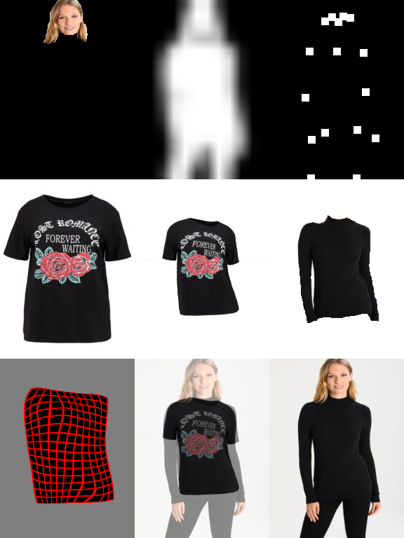
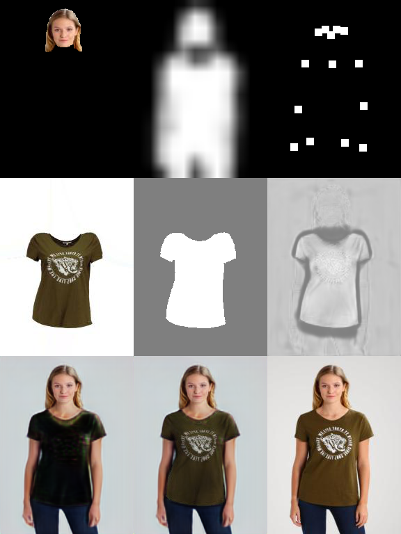
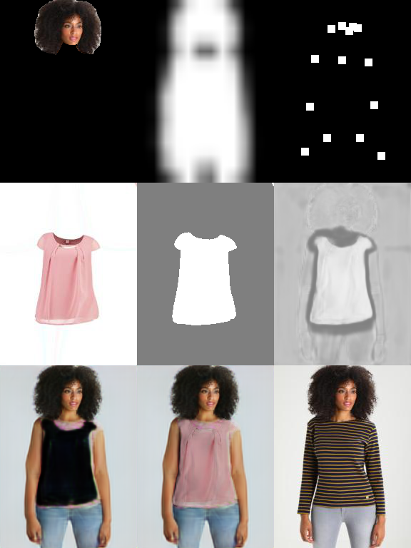

# Toward Characteristic-Preserving Image-based Virtual Try-On Network

Reimplemented code for eccv2018 paper 'Toward Characteristic-Preserving Image-based Virtual Try-On Network'. 

The results may have some differences with those of the original code.

This code is tested with pytorch=0.4.0

## Data preprocessing

We convert the original data [VITON](https://github.com/xthan/VITON) into different directories for easily use. 

Run the matlab code ```convert_data.m ``` under the original data root ```VITON/data```, and get the new format.

We use the json format for pose info as generated by [OpenPose](https://github.com/CMU-Perceptual-Computing-Lab/openpose).

Move these directories into our own dataroot ```data```.

You can get the processed data at [GoogleDrive](https://drive.google.com/open?id=1MxCUvKxejnwWnoZ-KoCyMCXo3TLhRuTo) or by running:

```
python data_download.py
```

## Geometric Matching Module

### training
We just use L1 loss for criterion in this code. 

TV norm constraints for the offsets will make GMM more robust.

An example training command is
```
python train.py --name gmm_train_new --stage GMM --workers 4 --save_count 5000 --shuffle
```
You can see the results in tensorboard, as show below.
<div align="center">
  
    <p>Example of GMM train. The center image is the warped cloth.</p>
</div>

### eval

Choose the different source data for eval with the option ```--datamode```.

An example training command is
```
python test.py --name gmm_traintest_new --stage GMM --workers 4 --datamode test --data_list test_pairs.txt --checkpoint checkpoints/gmm_train_new/gmm_final.pth
```

You can see the results in tensorboard, as show below.

<div align="center">
  
    <p>Example of GMM test. The center image is the warped cloth.</p>
</div>

## Try-On Module
### training
Before the trainning, you should generate warp-mask & warp-cloth, using the test process of GMM with `--datamode train`. 
Then move these files or make soft links under the directory `data/train`.
An example training command is

```
python train.py --name tom_train_new --stage TOM --workers 4 --save_count 5000 --shuffle 
```
You can see the results in tensorboard, as show below.

<div align="center">
  
    <p>Example of TOM train. The center image in the last row is the synthesized image.</p>
</div>


### eavl
An example training command is

```
python test.py --name tom_test_new --stage TOM --workers 4 --datamode test --data_list test_pairs.txt --checkpoint checkpoints/tom_train_new/tom_final.pth
```

You can see the results in tensorboard, as show below.

<div align="center">
  
    <p>Example of TOM test. The center image in the last row is the synthesized image.</p>
</div>


## Citation
If this code helps your research, please cite our paper:

	@inproceedings{wang2018toward,
		title={Toward Characteristic-Preserving Image-based Virtual Try-On Network},
		author={Wang, Bochao and Zheng, Huabin and Liang, Xiaodan and Chen, Yimin and Lin, Liang},
		booktitle={Proceedings of the European Conference on Computer Vision (ECCV)},
		pages={589--604},
		year={2018}
	}


